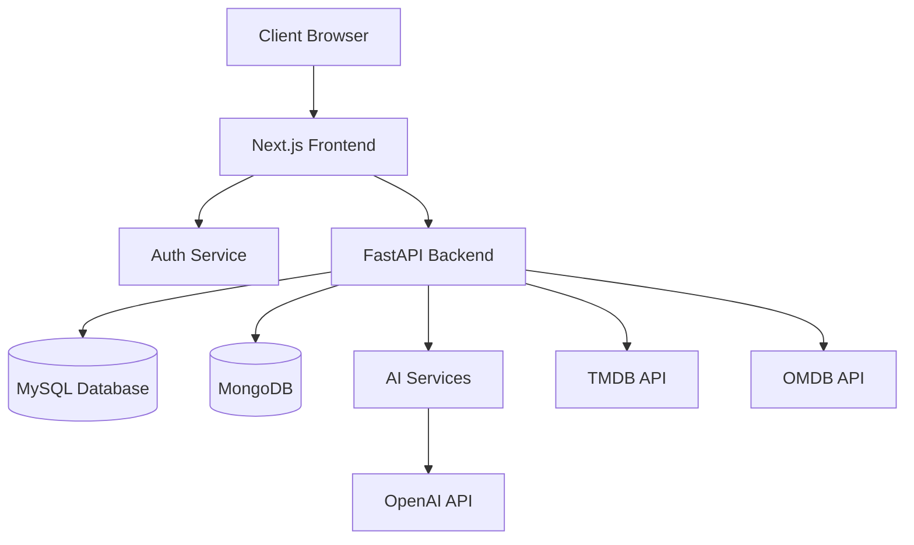

# Movie Wizard Documentation

## Table of Contents
1. [Overview](#overview)
2. [Architecture](#architecture)
3. [Installation](#installation)
4. [Features](#features)
5. [API Documentation](#api-documentation)
6. [Frontend Components](#frontend-components)
7. [Database Schema](#database-schema)
8. [Development & Deployment](#development--deployment)
9. [Environment Variables](#environment-variables)
10. [Security](#security)

## Overview
Movie Wizard is a full-stack web application that provides movie recommendations, library management, and interactive movie exploration features. The application uses Next.js for the frontend, FastAPI for the backend, and integrates with multiple movie databases and AI capabilities.

### Core Technologies
- Frontend: Next.js 14, TypeScript, TailwindCSS
- Backend: FastAPI, Python
- Databases: MySQL, MongoDB
- AI: OpenAI integration, Langchain
- Containerization: Docker
- Authentication: NextAuth.js

## Architecture

### System Architecture Diagram


### Docker Services
The application uses multiple containerized services:
- Frontend (Next.js)
- Backend (FastAPI)
- MySQL Database
- MongoDB
- Nginx Reverse Proxy

## Installation

### Prerequisites
- Docker and Docker Compose
- Node.js 21+
- Python 3.10+
- MySQL 8+

### Setup Steps

1. Clone the repository:
```bash
git clone <repository-url>
cd movie-wizard
```

2. Create environment files:
```bash
cp .env.example .env.dev
cp .env.example .env.prod
```

3. Install dependencies:
```bash
# Frontend
cd frontend
npm install

# Backend
cd backend/app
pip install -r requirements.txt
```

4. Start development environment:
```bash
./development.sh
```

## Features

### 1. Movie Library Management
- Personal movie library
- Watchlist functionality
- Movie recommendations
- Detailed movie information

### 2. AI Integration
- Natural language movie search
- Personalized recommendations
- Conversation-based movie discovery

### 3. Analytics Dashboard
- Library metrics
- Genre distribution
- Watch statistics
- Top actors and directors

## API Documentation

### Backend Endpoints

#### Search API
- `/search/similarity/`: Vector similarity search
- `/search/movies/`: MySQL-based search
- `/search/recommendations/`: Personalized recommendations

#### User Management
- User library management
- Watchlist operations
- User preferences

### Frontend API Routes
- Authentication
- Chat functionality
- Movie data fetching

## Database Schema

### MySQL Schema
- Movies table with comprehensive movie metadata
- Full-text search capabilities
- Optimized for quick retrieval

### MongoDB Collections
- Users
- Sessions
- Chat History

## Development & Deployment

### Development Mode
```bash
./development.sh
```

### Production Deployment
```bash
./deployment.sh
```

## Environment Variables

Required environment variables:
- `APP_ENV`: Environment (dev/prod)
- `NEXT_PUBLIC_MWAPI`: Backend API URL
- `NEXT_PUBLIC_OMDBAPI_URL`: OMDB API URL
- `NEXT_PUBLIC_OMDBAPI_KEY`: OMDB API Key
- `NEXT_PUBLIC_TMDB`: TMDB API URL
- `NEXT_PUBLIC_TMDB_KEY`: TMDB API Key
- `NEXT_PUBLIC_TMDB_IMAGE_URL`: TMDB Image URL
- `MYSQL_*`: MySQL configuration
- `MONGODB_URI`: MongoDB connection string

## Security

### Authentication
The application uses NextAuth.js for authentication with the following features:
- Session management
- OAuth integration
- Secure cookie handling

### API Security
- CORS configuration
- Rate limiting
- Input validation

### Data Protection
- Encrypted environment variables
- Secure database connections
- XSS protection

## Contributing

### Development Workflow
1. Create feature branch
2. Make changes
3. Run tests
4. Submit pull request

### Code Style
- Frontend: TypeScript strict mode
- Backend: PEP 8 guidelines
- Use ESLint and Prettier

## License
[Add your license information here]

---

## Getting Started with Development

First, run the development server:

```bash
npm run dev
# or
yarn dev
# or
pnpm dev
# or
bun dev
```

Open [http://localhost:3000](http://localhost:3000) with your browser to see the result.

You can start editing the page by modifying `app/page.tsx`. The page auto-updates as you edit the file.

This project uses [`next/font`](https://nextjs.org/docs/app/building-your-application/optimizing/fonts) to automatically optimize and load [Geist](https://vercel.com/font), a new font family for Vercel.

## Learn More

To learn more about Next.js, take a look at the following resources:

- [Next.js Documentation](https://nextjs.org/docs) - learn about Next.js features and API.
- [Learn Next.js](https://nextjs.org/learn) - an interactive Next.js tutorial.

You can check out [the Next.js GitHub repository](https://github.com/vercel/next.js) - your feedback and contributions are welcome!

## Deploy on Vercel

The easiest way to deploy your Next.js app is to use the [Vercel Platform](https://vercel.com/new?utm_medium=default-template&filter=next.js&utm_source=create-next-app&utm_campaign=create-next-app-readme) from the creators of Next.js.

Check out our [Next.js deployment documentation](https://nextjs.org/docs/app/building-your-application/deploying) for more details.
